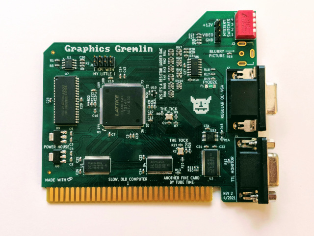

# Graphics Gremlin HDMI

This is a modified version of the Graphics Gremlin ISA graphics card to include a HDMI port. This is still based on the same Lattice ICE40HX4K FPGA.


Top view of board


Left is the original Graphics Gremlin, right is my modified design.

Bootup and CGA compatibliity tester: https://www.youtube.com/watch?v=xLy6on_o4YM
8088MPH: https://www.youtube.com/watch?v=WLpNmEhdTe4
Area5150 (using CGA overscan): https://www.youtube.com/watch?v=9wYU6qMWlpE

Here is the list of changes:

* Hardware changes
    * Added HDMI port by removing the RGBI DB9 port. Port positions adjusted to ease trace routing.
    * Added [TI TFP410](https://www.ti.com/product/TFP410) DVI transmitter (HDMI is compatible with DVI). HDMI is independent of the VGA/Composite output.
    * Test points for inputs to DVI transmitter.
    * Replaced the 3.3VDC 1A linear regulator with 3A as TFP410 is power hungry at up to 1A.
    * Added pin headers for power.
    * Added LED power indicators for 5V and 3.3V.
    * 2-layer -> 4-layer board to ease routing.
* HDL code changes
    * Selectable MDA colours
    * Removed normal MDA bitstream as there is no more RGBI port.
    * Added CGA 70Hz mode.
    * Added CGA 60Hz overscan mode.
    * Modified Scandoubler code to support Display Enable signal as required by DVI chip but not VGA.

## Switches position

### Switches 3 and 4

| 3      | 4      | Bitstream   | Function               |
|--------|--------|-------------|------------------------|
| open   | open   | Bitstream 0 | MDA 70Hz               |
| open   | closed | Bitstream 1 | CGA 70Hz               |
| closed | open   | Bitstream 2 | CGA 60Hz               |
| closed | closed | Bitstream 3 | CGA 60Hz with overscan |

#### CGA 60 and 70Hz 
After internal scandoubling, the CGA 60Hz will produce a 640x400x60Hz output suitable for most VGA monitors. While this works for the HDMI LCD monitors I have tested, it is technically below the DVI specification of a minimum of 640x480x60Hz and 25.175Mhz pixel clock. 

To meet the specification in case some monitors insist, I have added another mode CGA 70Hz which will produce 640x400 at 70Hz. (Actually 71Hz due to precision limitations of clock multiplying) This 70Hz is however not compatible with composite displays including the one inside IBM5155.

#### CGA 60Hz with overscan

The CGA overscan bitstream will show the overscan sections beyond the usual display area just short of Hsync and Vsync. Overscan is used in some demos like Area 5150. However not all HDMI monitors can accept this signal and/or display this properly.

I notice that while a monitor may initially accept this mode, tendency is it will randomly throw you display errors later.

**The purpose of this mode is just for debug and demo purposes**.

### Switches 1 and 2 for MDA

| 1      | 2      | MDA colour |
|--------|--------|------------|
| open   | open   | Green      |
| open   | closed | Yellow     |
| closed | open   | White      |
| closed | closed | Red        |


Sample of the different colours when testing the card on my [486 PC](https://github.com/yeokm1/retro-configs/tree/master/desktops/generic-486-pc).

### Switches 1 and 2 for CGA

| Switch | CGA                                  |
|--------|--------------------------------------|
| 1      | closed=composite mode. open=VGA mode |
| 2      | closed=thin font. open=normal font   |

No change from original Graphics Gremlin.

## Updated directory structure

```
|-- fab: Gerbers, BOM and PDF schematic
|-- images: Images used in this repo
|-- isa-video: Kicad Design files
|-- verilog: Updated Verilog code to support HDMI
|-- vga_display_status: Vivado project to process ICE40 FPGA output to DVI transmiter that runs on my Mimas A7 FPGA board.
|-- isabracket.stl: Card bracket for the original Grahpics Gremlin. (Not compatible with this new design)
```

## Verilog Toolchain

To compile the project, I used the following open source tool-chain on my Ubuntu running on WSL on Windows 11.

```bash
sudo apt install libftdi-dev cmake

sudo apt install build-essential libboost-system-dev libboost-thread-dev libboost-program-options-dev libboost-test-dev libboost-filesystem-dev libboost-iostreams-dev libeigen3-dev

sudo apt install tclsh clang tcl-dev libreadline-dev bison flex

# Icestorm
git clone https://github.com/YosysHQ/icestorm.git icestorm
cd icestorm
make -j$(nproc)
sudo make install
cd ..

# NextPNR
git clone https://github.com/YosysHQ/nextpnr nextpnr
cd nextpnr
cmake -DARCH=ice40 -DCMAKE_INSTALL_PREFIX=/usr/local .
make -j$(nproc)
sudo make install
cd ..

# Yosys
git clone https://github.com/YosysHQ/yosys.git yosys
cd yosys
make -j$(nproc)
sudo make install
```

To program the bitstream to the board, I used `iceprog` from OSS CAD Suite. Follow the Windows instructions in the original Grahpics Gremlin readme below.

## Code compilation

In my Ubuntu WSL:

```bash
cd verilog
mkdir build
make
```

```bash
# Program my provided bitstream
iceprog -p isavideo.binm

# Program newly compiled bitstream
iceprog -p build/isavideo.binm
```

## Known issue with brown colour

This palette value "I:0 R:1 G:1 B:0" is not handled correctly and is displayed as dark yellow instead of brown as of the CGA standard. This is due to lack of pins on the FPGA to provide more than a 4-bit RGBI output to the DVI transmitter.


My IBM 5155 running the [CGA Compatibility Tester](https://github.com/MobyGamer/CGACompatibilityTester) displaying the colour palatte.

## Testing with Mimas A7 (Xilinx Artix 7)

As part of my testing, I also made a small FPGA test project using another FPGA board Mimas A7 based on the Xilinx Artix 7. 


The FPGA test board reads the raw RGBI, HS, VS, DE and CLK signals that are given to the DVI transmitter and displays the output using its own HDMI output.

The code is heavily based on the [HDMI_FPGA](https://github.com/dominic-meads/HDMI_FPGA/) project by Dominic Meads and runs on Vivado 2023.

# The Graphics Gremlin - a Retro ISA Video Card

The Graphics Gremlin is an FPGA-based ISA video card specifically designed to emulate certain old video standards. This initial release emulates the original IBM PC monochrome graphics adapter (MDA) as well as the original IBM color graphics adapter (CGA). Since the logic is defined by the bitstream loaded into the FPGA, new emulations may be available in the future to support other video standards.



But why emulate an old video card when they are still fairly easy to find online? Cards aren't hard to find, but monitors that can sync to the unusual frequencies used by MDA (18KHz) and CGA (15KHz) are much harder to find, and these frequencies are rarely supported by modern LCD monitors or video capture hardware.

For both MDA and CGA, the Graphics Gremlin has a VGA port that can deliver video running at standard (31KHz) frequencies that are well supported by LCD monitors, VGA-to-HDMI converters, and USB capture devices.

Here are the design files. The BOM includes Mouser Electronics parts numbers for everything except for the 0.1" headers which are typically cut to length anyway.

[Schematic](https://github.com/schlae/graphics-gremlin/blob/main/isavideo.pdf)

[Bill of Materials](https://github.com/schlae/graphics-gremlin/blob/main/isavideo.csv)

[Fab Files](https://github.com/schlae/graphics-gremlin/blob/main/fab/isavideo_rev2.zip)

## Fabrication and Assembly Notes

The circuit board is a 2-layer board, 4.19 x 3.74 inches (106 x 95mm). No special edge connector bevel is required, but you may want to specify at least ENIG plating. If you are rich then you could spend the extra money and get hard gold plated edge fingers. Order the boards with a fancy soldermask color so you can show off, or stick with a plain green to blend in.

You probably shouldn't attempt this project if you've never soldered surface mount components before. It'll lead to a lot of frustration and potentially damaged boards and parts.

There are two main methods you can use to assemble the board: reflow and hand soldering. Using the reflow method means that you'll need to order the solder stencil for the top side (there are no parts on the bottom of the board), and be sure to have fresh solder paste and some sort of vacuum pick-and-place tool. This method can be very quick but does require some skill and practice. 

Hand soldering is good when you only want to assemble a single board. This board has no BGA or leadless components which makes hand soldering possible. Some components have a very fine lead pitch (0.5mm) so only attempt this if you are comfortable with your soldering skills.

No matter which method you use, I recommend inspecting every solder joint very carefully under a microscope to make sure there are no solder bridges. If there are, clean them out with some solder braid.

Be careful not to mix up the two voltage regulators: they provide *different* voltages!

R11 should not be stuffed. By default this means that the 14.318MHz clock is generated on board. If you *move* R25 to R11, then the 14.318MHz clock comes from the ISA bus. The motherboard's 14.318MHz oscillator isn't always accurate enough for CGA color composite video.

Header J6 is optional. If you want to install it, remove pin 2 for keying.

Before plugging the card into a PC, it is wise to use a multimeter to verify that there are no short circuits between the +5V line (ISA bus pin B3) and ground or between the +12V line (ISA bus pin B9) and ground.

The card bracket may be fabricated from a plain, blank bracket such as a Keystone Electronics 9200. The dimensions are included in the KiCad file on the Dwgs.User layer. The best way to make holes in the bracket is by using a hand-operated sheet metal punch. A chassis nibbler is useful for making the DE-9 openings and the opening for the DIP switch bank.

You can also try 3D printing the bracket using the file below. There is a small line printed near the top which marks where you have to bend the bracket after you finish printing it. Use a hair dryer or a heat gun (on low) to soften it, and then bend it over a straightedge or ruler. For a slightly better finish on the outside of the bracket, flip it over in your slicer software so that the outside surface faces the bed of the printer.

[ISA bracket STL file](https://github.com/schlae/graphics-gremlin/blob/main/isabracket.stl)

## The FPGA
[A separate document discusses the Verilog code.](https://github.com/schlae/graphics-gremlin/blob/main/verilog/README.md)

Programming the FPGA is fairly easy and can be done with an FTDI FT2232H Mini Module [datasheet here](https://www.ftdichip.com/Support/Documents/DataSheets/Modules/DS_FT2232H_Mini_Module.pdf).

Wiring for the FT2232H mini module is as follows:

| Point 1    | Point 2       | Description           |
| ---------- | ------------- | --------------------- |
| CN2 pin 1  | CN2 pin 11    | V3V3 to VIO strap     |
| CN3 pin 1  | CN3 pin 3     | VBUS to VCC strap     |
| CN2 pin 3  | CN3 pin 12    | V3V3 to VIO strap (2) |
| CN2 pin 14  | SPI cable pin 1 | CS                 |
| CN2 pin 16  | SPI cable pin 2 | CDONE              |
| CN2 pin 7   | SPI cable pin 3 | SCK (serial clock) |
| CN2 pin 15  | SPI cable pin 4 | CRESET             |
| CN2 pin 9   | SPI cable pin 5 | CIPO (controller in, peripheral out) |
| CN2 pin 2   | SPI cable pin 6 | GND                |
| CN2 pin 10  | SPI cable pin 7 | COPI (controller out, peripheral in) |
| n/a         | SPI cable pin 8 | not used           |

To program the FPGA, power needs to be applied. The simplest way to do this is to drop it in a nearby PC and turn it on. With the cable plugged in to a USB port, you can use the [Project IceStorm](http://www.clifford.at/icestorm/) tool "iceprog" to program the SPI flash memory.

`iceprog -p isavideo.binm`

Once the SPI flash has been programmed, iceprog toggles the reset line so that the FPGA loads the new bitstream. At this point it will be active on the ISA bus, but the PC's BIOS doesn't know about it. Reboot the computer and it should find it.

Note that leaving the programming cable plugged in can sometimes cause issues with the FPGA being held in reset when the PC powers up. In that case, simply unplug the cable and reboot the PC.

### Windows Instructions
Thanks to [midicdj1000](https://github.com/midicdj1000), here are some instructions for programming the FPGA using Windows.

1. Download and extract the Windows build of the [OSS CAD Suite](https://github.com/YosysHQ/oss-cad-suite-build/releases).
2. Connect the FT2232H mini module according to the directions in the previous section.
3. Install the [FTDI driver](https://ftdichip.com/drivers/).
4. Change the driver to libusbK using these [instructions](https://learn.adafruit.com/adafruit-ft232h-breakout/windows-setup).
5. From the command line in the Bin folder of the OSS-CAD-Suite folder, run `iceprog -p isavideo.binm`. (Be sure to include the appropriate path to the isavideo.binm file, or simply copy the file into the Bin folder.)

## The Red Switch Bank

The red switch bank on the top right of the card controls two things: the bitstream selected by the FPGA when it powers up and specific settings for the selected bitstream.

The bitstream is selected using switches 3 and 4:

|   | 3      | 4      | Description | Default                                   |   |
|---|--------|--------|-------------|-------------------------------------------|---|
|   | open   | open   | Bitstream 0 | MDA (VGA compatible signal)               |   |
|   | open   | closed | Bitstream 1 | MDA (MDA monitors only)                   |   |
|   | closed | open   | Bitstream 2 | CGA (both VGA and CGA compatible signals) |   |
|   | closed | closed | Bitstream 3 | Not used                                  |   |

For example, if you want to use MDA with a VGA monitor, set switches 3 and 4
to the open (up) position. (CGA has support for both VGA and CGA monitors built in since it implements a line doubler.)

The remaining two switches have a function that is bitstream-dependent.

| Switch | MDA (VGA comp.) | MDA | CGA |
| ------ | --------------- | --- | --- |
| 1      | Not used | Not used | closed=composite mode. open=VGA mode |
| 2      | Not used | Not used | closed=thin font. open=normal font |

## Connectors

The Graphics Gremlin provides both a 9-pin RGBI connector and a 15-pin VGA connector. The 9-pin connector is designed for use with digital monitors such as the IBM 5151, 5153, or a variety of older multisync monitors.

The RCA jack is used for CGA composite video when that bitstream is selected (see the previous section). Note that the signal for the RCA jack is also used as the green channel for the VGA connector so they cannot both be used at the same time.

Connector J6 is for compatibility with IBM CGA cards which provide the composite signal for RF modulators. This connector is really only useful if you want to use the card with an IBM 5155 Portable PC (the internal monitor has a cable that plugs into this connector).

## Troubleshooting

This is a complex card with many fine-pitch components, so most likely any issues you run into will be caused by a solder bridge or broken connection. Go back and check each solder joint using a microscope. Make sure you didn't install any chips or the clock oscillators the wrong way around.

A few things to confirm for basic operation include:

1. Are the 3.3V and 1.2V regulators putting out those voltages?
2. Are the two clock oscillators generating 10MHz and 14.318MHz?
3. Can the SPI flash get programmed by the FTDI board *and verified?*

Unlike the namesake video cards of old, the FPGA comes up with the internal card registers fully programmed and the card should generate video even if the ISA bus interface isn't working at all. A simple check involves configuring the switch bank for CGA and confirming that it produces a video signal. You can even flip to composite mode to make sure that works as well.

Checking these first can help you narrow down the source of the problem.

To confirm proper operation on the ISA bus, it's helpful to set up a PC with a VGA card (or CGA card) and the Graphics Gremlin configured for MDA. These can coexist on the same PC.

Boot up the PC and run the DOS DEBUG program. Then see if you can access the CRTC registers. Unlike the original MDA card, these can be read back. Note: if you use the VGA compatible MDA mode, then these registers cannot be written to.

```
o 3b4 0
i 3b5
```

This should return a number that is not 0 or FF. (The exact number depends on which MDA bitstream you are using).

If that works, then check to see if you can read and write the MDA video memory area:

`e b000:0000 55 aa 55 aa`...

and to check what you just wrote

`d b000:0000`

This will exercise the connections to the SRAM.

Other strange things that can happen:
* If the PC just beeps out an error code during startup, check for motherboard jumpers or switches that have to be set. You might also try a dual video card setup with a VGA card.
* If the PC never boots at all, it could be that the IO\_READY pin (A10) on the ISA bus is stuck low. Also check for any short circuits on the address, data, or control lines.
* If the PC power supply refuses to start or if there is smoke, then you probably have a short circuit on the +5V or +12V line on the card. Check for things like solder paste smeared underneath capacitors or traces shorted to the ground plane.

In general, use a logical process of elimination to find where the fault (or faults!) lurks.

## Emulation Accuracy

The logic for both the MDA and CGA cards is as close as I could get it to match the schematics available in the technical reference manuals, with two exceptions. The VRAM interface is specific to the 8-bit SRAM chip that I am using instead of the 16-bit SRAM on the original MDA or the 16-bit DRAM used on the CGA, so it had to be quite different from the originals. As a result, the sequencer state machine had to be designed from scratch. There are some other minor differences mostly to support the nonstandard VGA-compatible signal outputs.

Accuracy is a work in progress. Certain demos, like 8088MPH, that require cycle-accurate operation on a 4.77MHz PC, don't work 100% correctly. The causes of this aren't yet fully understood.

## Future Plans

Although the card supports just MDA and CGA, I'd like to support other video standards in the future. EGA and even VGA would be nice, but there are two huge challenges associated with that: they use custom gate array chips and they also use a 32-bit memory bus. This means I would need to quadruple the pixel clock to produce four 8-bit fetches from the SRAM. Due to this bus bandwidth limitation, Super VGAs are totally off the table.

Other people have requested support for Hercules, Tandy, and PCjr graphics, which I might get around to implementing someday.

There are also some neat non-graphics uses for the card. With some clever programming, the card could be turned into a memory card to extend the RAM in some of the older IBM PC and XT machines (XMS RAM). It could also emulate an expanded memory card for machines that can't run EMM386. BIOS extension ROMs stored in the NOR flash chip could also be mapped to ROM areas in the PC memory map, which might also be useful.

The card could act as a fancy POST card, perhaps even with a mini bus analyzer built in (using a connected VGA monitor).

It's even theoretically possible to implement a sound card using the composite video jack (and 7-bit resistor DAC) as the sound output.

## License
This work is licensed under a Creative Commons Attribution-ShareAlike 4.0
International License. See [https://creativecommons.org/licenses/by-sa/4.0/](https://creativecommons.org/licenses/by-sa/4.0/).
